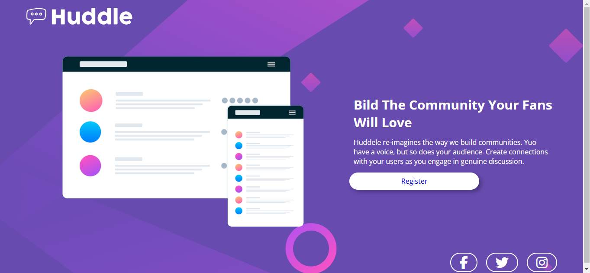
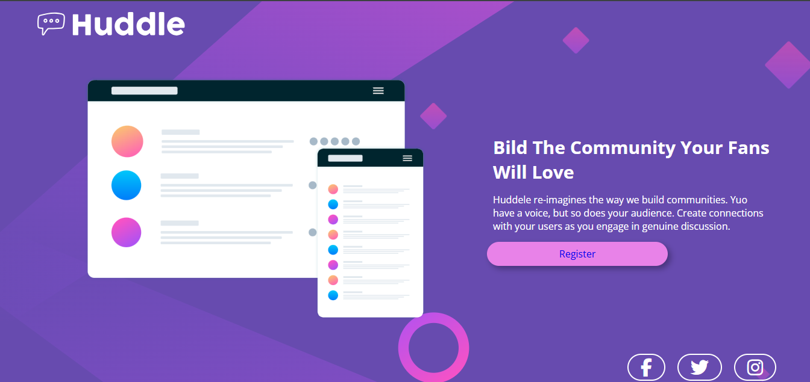
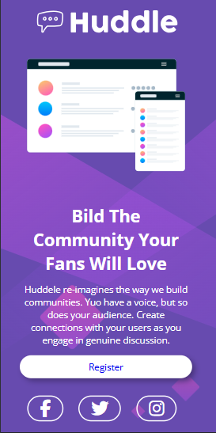

# ⚔️ QUEST HTML + CSS Avançado (huddle-page)
<b>Projeto desenvolvido para verificar as habilidades adiquiridas em durante o curso de HTML e CSS. 
## Tecnologia Utilizada: HTML e CSS

### Antes de começar a fazer o Código.
Verificamos o Desing e separamos em camadas para facilitar a escrita do código como vemos na imagem abaixo:

## Foi desenvolvido o Modelo Desktop e também para modelo Mobile.

### <b>Desktop

No botão de "Register" e nos icones das redes sociais foi adicionado um <:hover> onde troca a cor.

### <b>Mobile
Aqui apresentamos a vesão Mobile do código:

